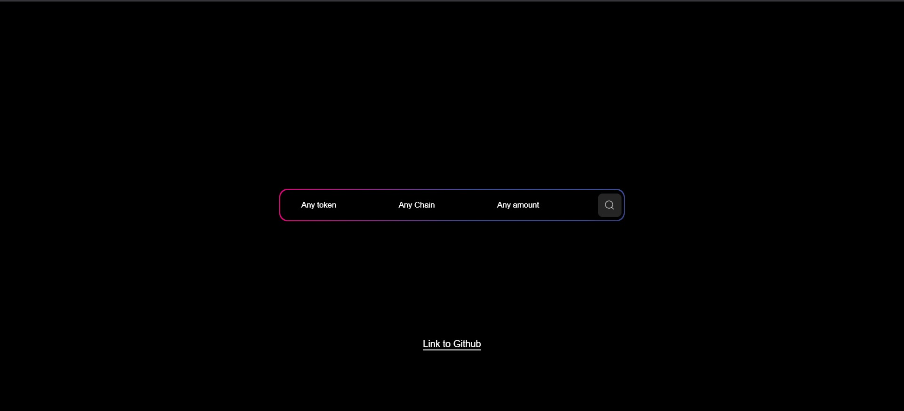
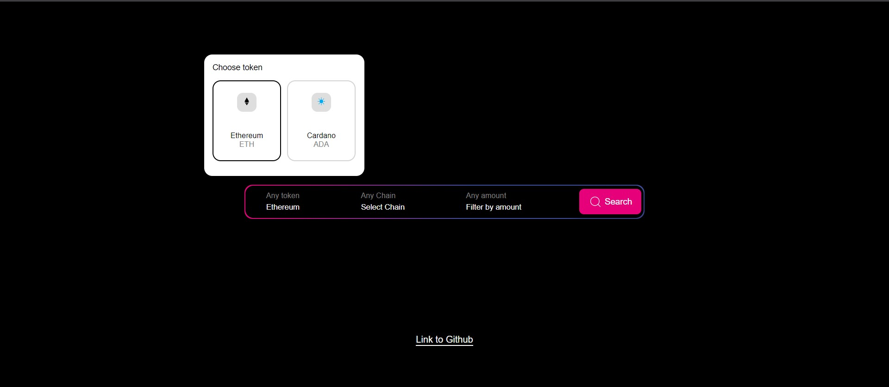
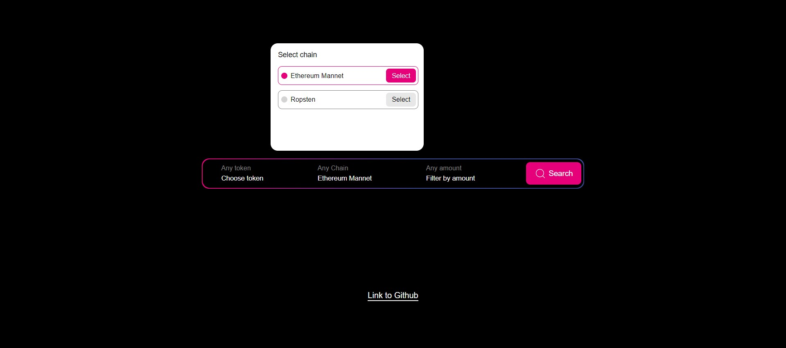
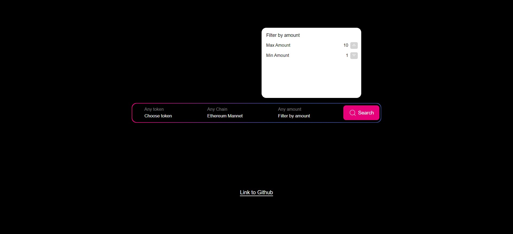

# Polkadex - Frontend Developer - Coding Challenge

UI component made as given in [Figma](https://www.figma.com/proto/6toqGDBQmJuw8NB8z5TQN4/Search-Challenge?page-id=0%3A1&node-id=2%3A1388&viewport=383%2C430%2C0.47&scaling=scale-down&starting-point-node-id=2%3A443&show-proto-sidebar=1)

## Tech Stack Used 
1. Nextjs + React
2. Typescript
3. Styled components or Component-Level CSS
4. React-group-transition or framer motion
6. ESLint & Prettier

## Run Locally
1. Clone the repo in local machine
2. Run the command `npm install` in root of the project.
3. Run command `npm run dev` to watch it live on [http://localhost:3000/](http://localhost:3000/) 

## Watch Live
Project is deployed at [https://polkadex-frontend-challange.vercel.app/](https://polkadex-frontend-challange.vercel.app/)

## Demo Images

## Developer
[Arjun Porwal](https://github.com/ap211unitech/)